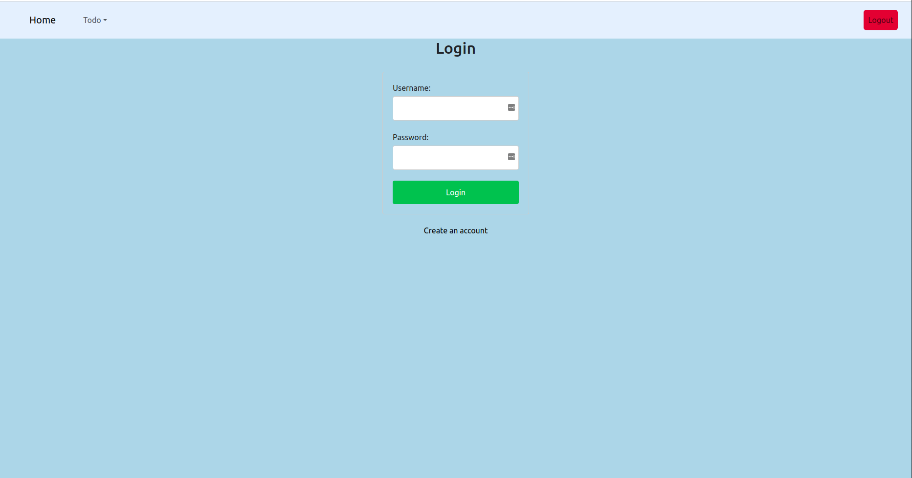
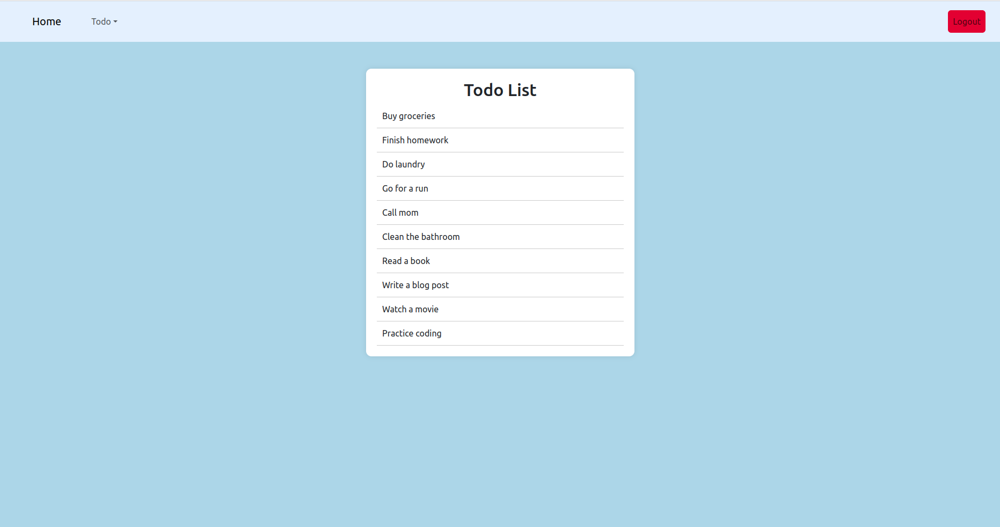
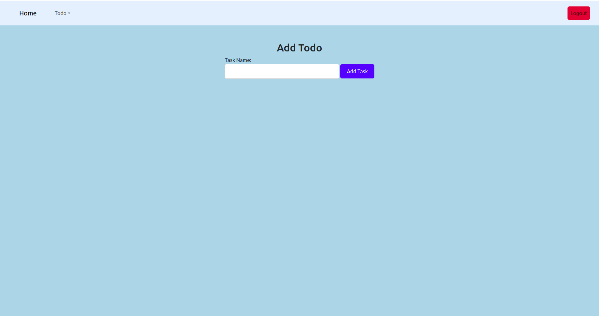
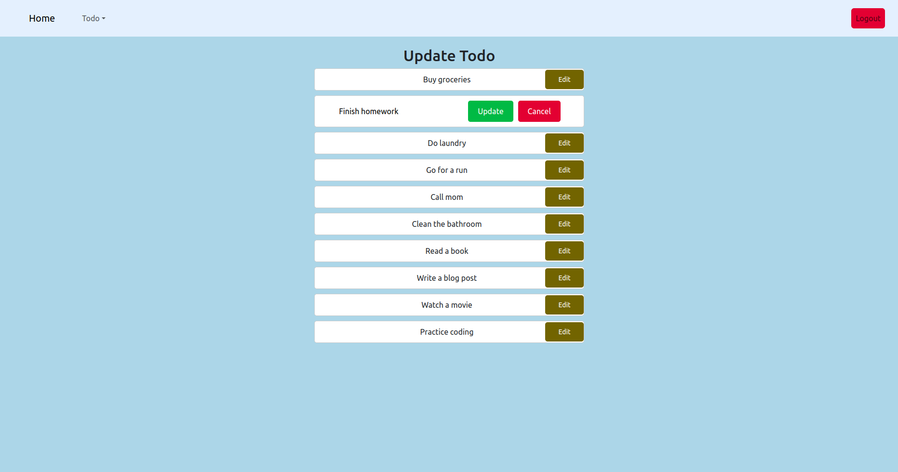
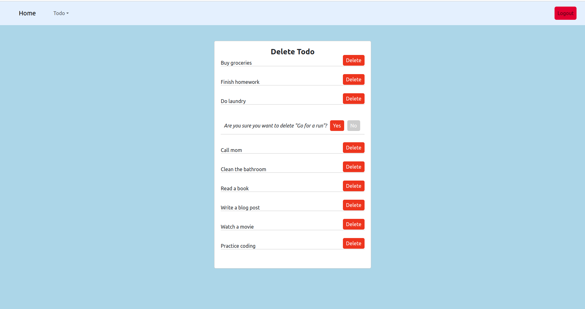

# Todo Application

A simple web application for managing a todo list.

## Cloning and Setup

1. Clone this repository to your local machine using the command:

        git@github.com:ErnestH1/todo-app.git

2. Navigate into the project directory using the command:

        cd todo-app
3. Install dependencies using 

        npm install

4. Start the application using 

        npm start

5. Navigate to http://localhost:3000 to view the app in the browser or follow the link   https://main--dulcet-licorice-5cd9c4.netlify.app/ to view the deployed site

    
## Description and Features

This web application allows users to create, edit, and delete tasks on a todo list. 

The user interface consists of 
1. A header with the title of the app
2. A form for adding new tasks
3. A list of current tasks. 

Each task in the list includes the task text and two buttons for editing and deleting the task.

### Features:

- Login

1. Lists all existing tasks 

2. Add a new task to the todo list

3. Edit an existing task

4. Delete a task from the todo list

## Conclusion

This simple todo list app is a great starting point for learning web development with React. It demonstrates basic concepts such as state management, component lifecycle, and handling user input.

### Technologies Used

- React
- CSS
- Bootstrap

- Node.js
- NPM

## License

This project is licensed under the MIT License.

## Author

Ernest Hanson

